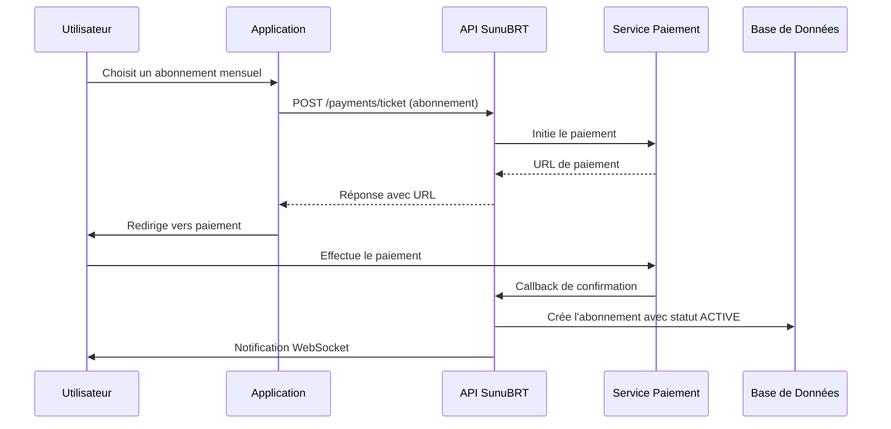
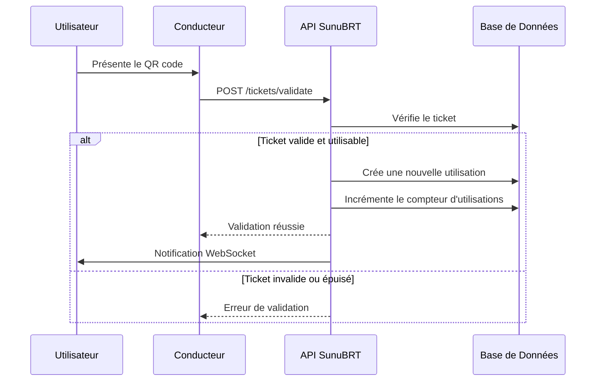

# Système de Tickets Réutilisables et Abonnements - SunuBRT

## Vue d'ensemble

Le système de tickets SunuBRT a été étendu pour supporter les tickets réutilisables et les abonnements, permettant aux utilisateurs d'avoir des passes mensuels, hebdomadaires ou journaliers qui peuvent être utilisés plusieurs fois selon les règles définies.

## Changements Principaux

### 1. Types de Tickets Supportés

| Type | Description | Réutilisable | Durée Typique | Utilisations |
|------|-------------|--------------|---------------|--------------|
| `SINGLE_USE` | Ticket à usage unique | Non | 1 voyage | 1 fois |
| `DAILY_PASS` | Pass journalier | Oui | 24 heures | Illimitées ou limitées |
| `WEEKLY_PASS` | Pass hebdomadaire | Oui | 7 jours | Illimitées ou limitées |
| `MONTHLY_PASS` | Abonnement mensuel | Oui | 30 jours | Illimitées ou limitées |
| `ANNUAL_PASS` | Abonnement annuel | Oui | 365 jours | Illimitées ou limitées |

### 2. Nouveaux Statuts de Tickets

| Statut | Description | Peut être utilisé |
|--------|-------------|-------------------|
| `PENDING` | Paiement en attente | Non |
| `PAID` | Ticket à usage unique payé | Oui (1 fois) |
| `ACTIVE` | Abonnement actif | Oui (selon limites) |
| `SUSPENDED` | Abonnement suspendu | Non |
| `CANCELLED` | Ticket annulé | Non |
| `EXPIRED` | Ticket expiré | Non |

### 3. Système de Tracking des Utilisations

Chaque utilisation d'un ticket est maintenant enregistrée dans la table `TicketUsage` avec :
- Date et heure d'utilisation
- Voyage/Route/Bus utilisé
- Conducteur/Contrôleur qui a validé
- Position GPS de validation (optionnel)
- Notes de validation

## Architecture des Données

### Modèle Ticket (Modifié)

```typescript
interface Ticket {
  id: number;
  userId: string;
  tripId?: number;              // Optionnel pour les abonnements
  ticketType: TicketType;       // SINGLE_USE, DAILY_PASS, etc.
  qrCode: string;
  status: TicketStatus;
  purchaseDate: Date;
  validFrom: Date;              // Date de début de validité
  validUntil?: Date;            // Date de fin de validité
  maxUsages?: number;           // Nombre max d'utilisations (null = illimité)
  currentUsages: number;        // Compteur d'utilisations actuelles
  isReusable: boolean;          // Indique si le ticket est réutilisable
  seatNumber?: string;
  notes?: string;

  // Relations
  user: User;
  trip?: Trip;                  // Optionnel pour les abonnements
  usages: TicketUsage[];        // Historique des utilisations
  payment?: Payment;
}
```

### Nouveau Modèle TicketUsage

```typescript
interface TicketUsage {
  id: number;
  ticketId: number;
  tripId?: number;              // Voyage où le ticket a été utilisé
  routeId?: number;             // Route utilisée
  busId?: string;               // Bus utilisé
  usedAt: Date;                 // Date/heure d'utilisation
  validatorId?: string;         // Conducteur qui a validé
  latitude?: number;            // Position GPS de validation
  longitude?: number;
  notes?: string;

  // Relations
  ticket: Ticket;
  trip?: Trip;
  route?: Route;
  bus?: Bus;
  validator?: User;
}
```

## Flux d'Utilisation

### 1. Création d'un Abonnement



### 2. Utilisation d'un Abonnement



## API Endpoints

### Endpoints Utilisateurs

#### Créer un Abonnement
```http
POST /api/v1/tickets/subscription
Authorization: Bearer {token}

{
  "paymentId": 123,
  "ticketType": "MONTHLY_PASS",
  "lineId": 1,                    // Optionnel : limiter à une ligne
  "validFrom": "2024-01-15T08:00:00Z",
  "maxUsages": 60,                // Optionnel : 60 voyages/mois
  "notes": "Abonnement mensuel ligne 1"
}
```

**Réponse :**
```json
{
  "id": 456,
  "ticketType": "MONTHLY_PASS",
  "qrCode": "SUNUBRT-SUB-1705747200-abc123",
  "status": "ACTIVE",
  "validFrom": "2024-01-15T08:00:00Z",
  "validUntil": "2024-02-15T08:00:00Z",
  "maxUsages": 60,
  "currentUsages": 0,
  "isReusable": true
}
```

#### Consulter l'Historique des Utilisations
```http
GET /api/v1/tickets/{id}/usage-history
Authorization: Bearer {token}
```

**Réponse :**
```json
{
  "ticket": {
    "id": 1,
    "ticketType": "MONTHLY_PASS",
    "currentUsages": 15,
    "maxUsages": 60,
    "validUntil": "2024-02-15T08:00:00Z"
  },
  "usages": [
    {
      "id": 1,
      "usedAt": "2024-01-20T08:30:00Z",
      "trip": {
        "routeName": "Dakar Centre → Guédiawaye",
        "busNumber": "BRT001"
      },
      "validator": {
        "name": "Amadou Conducteur"
      }
    }
  ],
  "summary": {
    "totalUsages": 15,
    "remainingUsages": 45,
    "canStillUse": true
  }
}
```

#### Suspendre/Réactiver un Abonnement
```http
PATCH /api/v1/tickets/{id}/suspend
Authorization: Bearer {token}

{
  "reason": "Vol du téléphone"
}
```

### Endpoints de Validation

#### Valider un Ticket/Abonnement
```http
POST /api/v1/tickets/validate
Authorization: Bearer {driver_token}

{
  "qrCode": "SUNUBRT-SUB-1705747200-abc123",
  "tripId": 1,                    // Optionnel pour abonnements
  "busId": "bus-001",
  "validationContext": "BOARDING",
  "latitude": 14.6937,
  "longitude": -17.4441,
  "notes": "Montée arrêt Dakar Centre"
}
```

**Réponse pour Abonnement :**
```json
{
  "isValid": true,
  "message": "Ticket validé avec succès. Utilisations restantes: 45",
  "ticket": {
    "id": 1,
    "ticketType": "MONTHLY_PASS",
    "isReusable": true,
    "currentUsages": 16,
    "maxUsages": 60,
    "passengerName": "Amadou Diallo",
    "validUntil": "2024-02-15T08:00:00Z"
  },
  "remainingUsages": 44,
  "canReuse": true
}
```

### Endpoints Admin

#### Statistiques des Abonnements
```http
GET /api/v1/tickets/admin/subscriptions/statistics
Authorization: Bearer {admin_token}
```

**Réponse :**
```json
{
  "summary": {
    "totalSubscriptions": 150,
    "activeSubscriptions": 120,
    "expiredSubscriptions": 25,
    "totalUsages": 4500,
    "averageUsagesPerSubscription": 30
  },
  "subscriptionsByType": [
    {
      "type": "MONTHLY_PASS",
      "count": 100,
      "totalUsages": 3000,
      "averageUsages": 30
    },
    {
      "type": "WEEKLY_PASS",
      "count": 30,
      "totalUsages": 900,
      "averageUsages": 30
    }
  ],
  "revenue": {
    "total": 750000,
    "average": 5000
  },
  "utilizationRate": 80
}
```

#### Analytics d'Utilisation
```http
GET /api/v1/tickets/admin/usage-analytics?period=daily&ticketType=MONTHLY_PASS
Authorization: Bearer {admin_token}
```

## Règles de Validation

### Contrôles Effectués lors de la Validation

1. **Existence du ticket** : Le QR code existe dans la base
2. **Statut du ticket** : PAID ou ACTIVE uniquement
3. **Période de validité** : Entre validFrom et validUntil
4. **Nombre d'utilisations** : currentUsages < maxUsages (si défini)
5. **Suspension** : Statut différent de SUSPENDED
6. **Autorisation conducteur** : Vérifie que le conducteur peut valider

### Types de Validations

- **BOARDING** : Montée dans le véhicule
- **INSPECTION** : Contrôle en cours de route
- **EXIT** : Sortie du véhicule (optionnel)

## Notifications WebSocket

### Événements Émis

- `subscriptionCreated` : Nouvel abonnement créé
- `ticket:validated` : Ticket utilisé avec succès
- `subscription:statusChanged` : Abonnement suspendu/réactivé
- `subscription:nearExpiry` : Abonnement bientôt expiré

### Exemple d'Écoute
```javascript
socket.on('ticket:validated', (data) => {
  console.log('Ticket utilisé:', data);
  // {
  //   ticketId: 1,
  //   usageId: 123,
  //   currentUsages: 16,
  //   remainingUsages: 44,
  //   tripInfo: { ... }
  // }
});
```

## Tarification des Abonnements

### Configuration dans TicketPricing

```json
{
  "name": "Abonnement Mensuel Ligne 1",
  "type": "PREMIUM",
  "ticketType": "MONTHLY_PASS",
  "price": 15000,
  "validityDuration": 30,
  "validityPeriodType": "DAYS",
  "maxUsages": 60,
  "isReusable": true,
  "lineId": 1,
  "usageRules": {
    "maxUsagesPerDay": 4,
    "allowedTimeRanges": [
      { "start": "06:00", "end": "10:00" },
      { "start": "16:00", "end": "20:00" }
    ],
    "weekendRestrictions": false
  }
}
```

## Gestion des Erreurs

### Codes d'Erreur Spécifiques

| Code | Message | Description |
|------|---------|-------------|
| `TICKET_SUSPENDED` | Ce ticket est suspendu | Abonnement suspendu par l'utilisateur/admin |
| `TICKET_MAX_USAGES_REACHED` | Nombre max d'utilisations atteint | Plus d'utilisations disponibles |
| `TICKET_NOT_YET_VALID` | Ce ticket n'est pas encore valide | Date de début non atteinte |
| `TICKET_ALREADY_USED` | Ticket déjà utilisé | Pour les tickets à usage unique |

## Cas d'Usage

### 1. Abonnement Mensuel Étudiant
- **Type** : MONTHLY_PASS
- **Prix** : 10 000 FCFA (réduction 33%)
- **Validité** : 30 jours
- **Utilisations** : 60 voyages maximum
- **Restrictions** : Carte étudiante requise

### 2. Pass Journalier Touriste
- **Type** : DAILY_PASS
- **Prix** : 2 000 FCFA
- **Validité** : 24 heures
- **Utilisations** : Illimitées
- **Restrictions** : Toutes lignes

### 3. Abonnement Annuel Premium
- **Type** : ANNUAL_PASS
- **Prix** : 150 000 FCFA
- **Validité** : 365 jours
- **Utilisations** : Illimitées
- **Avantages** : Priorité d'embarquement

## Migration des Données Existantes

### Script de Migration
```sql
-- Ajouter les nouvelles colonnes
ALTER TABLE tickets ADD COLUMN ticketType ENUM('SINGLE_USE', 'DAILY_PASS', 'WEEKLY_PASS', 'MONTHLY_PASS', 'ANNUAL_PASS') DEFAULT 'SINGLE_USE';
ALTER TABLE tickets ADD COLUMN validFrom DATETIME DEFAULT CURRENT_TIMESTAMP;
ALTER TABLE tickets ADD COLUMN maxUsages INT NULL;
ALTER TABLE tickets ADD COLUMN currentUsages INT DEFAULT 0;
ALTER TABLE tickets ADD COLUMN isReusable BOOLEAN DEFAULT FALSE;

-- Migrer les tickets existants
UPDATE tickets
SET ticketType = 'SINGLE_USE',
    isReusable = FALSE,
    currentUsages = CASE WHEN status = 'USED' THEN 1 ELSE 0 END
WHERE ticketType IS NULL;

-- Créer les enregistrements d'usage pour les tickets déjà utilisés
INSERT INTO ticket_usages (ticketId, tripId, usedAt, notes)
SELECT id, tripId, usedAt, 'Migration depuis ancien système'
FROM tickets
WHERE status = 'USED' AND usedAt IS NOT NULL;
```

## Monitoring et Métriques

### KPIs à Surveiller

- **Taux d'utilisation des abonnements** : currentUsages / maxUsages
- **Revenus par type d'abonnement**
- **Taux de renouvellement** des abonnements
- **Utilisations par heure/jour** pour optimiser les horaires
- **Taux de fraude** (validations suspectes)

### Alertes

- Abonnement avec trop d'utilisations par rapport à la normale
- Validations simultanées du même ticket
- Abonnements expirés non renouvelés
- Pic d'utilisations inhabituel

## Sécurité

### Prévention de la Fraude

1. **Limitation géographique** : Validation GPS
2. **Délai entre utilisations** : Éviter les utilisations trop rapprochées
3. **Détection d'anomalies** : Patterns d'usage suspects
4. **Cryptage des QR codes** : Inclure timestamp et signature

### Audit Trail

Toutes les actions sont loggées :
- Créations d'abonnements
- Validations de tickets
- Suspensions/réactivations
- Tentatives de fraude détectées

## Performance

### Optimisations Implémentées

- **Index sur les colonnes fréquemment utilisées**
  - `qrCode` (UNIQUE)
  - `userId, status`
  - `validFrom, validUntil`
  - `usedAt` dans TicketUsage

- **Cache des validations récentes** pour éviter les doubles validations
- **Pagination** des historiques d'utilisation
- **Agrégations précalculées** pour les statistiques

### Recommandations de Déploiement

- Surveillance des temps de réponse des validations (< 200ms)
- Backup régulier des données d'usage
- Nettoyage périodique des anciens enregistrements

## Conclusion

Le nouveau système de tickets réutilisables transforme SunuBRT en une solution de transport moderne et flexible, supportant différents types d'abonnements tout en maintenant la sécurité et la traçabilité nécessaires pour un système de transport public.

Les utilisateurs bénéficient de :
- **Flexibilité** : Différents types d'abonnements selon leurs besoins
- **Transparence** : Historique complet des utilisations
- **Contrôle** : Possibilité de suspendre temporairement leurs abonnements

Les opérateurs bénéficient de :
- **Analytics avancées** : Compréhension fine des patterns d'utilisation
- **Prévention de la fraude** : Système de validation robuste
- **Optimisation des revenus** : Tarifications flexibles et adaptées

---

**Version** : 1.0
**Date** : Décembre 2024
**Auteur** : Équipe Technique SunuBRT
